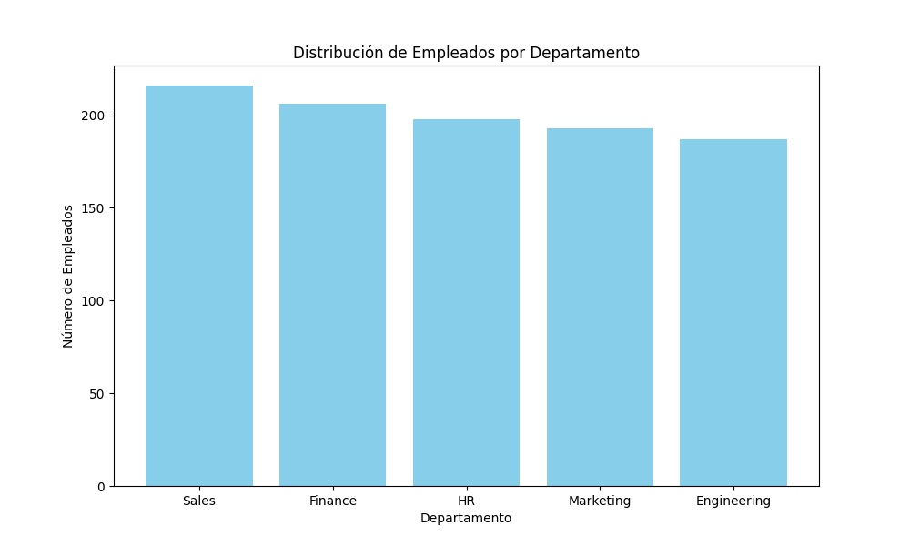
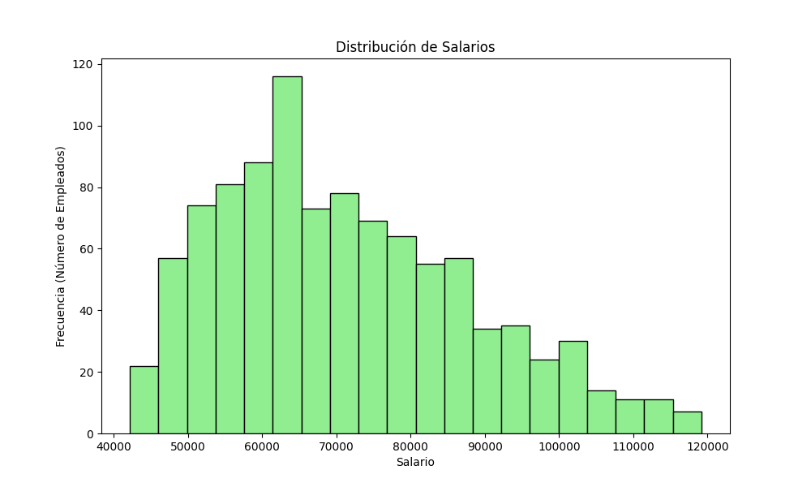
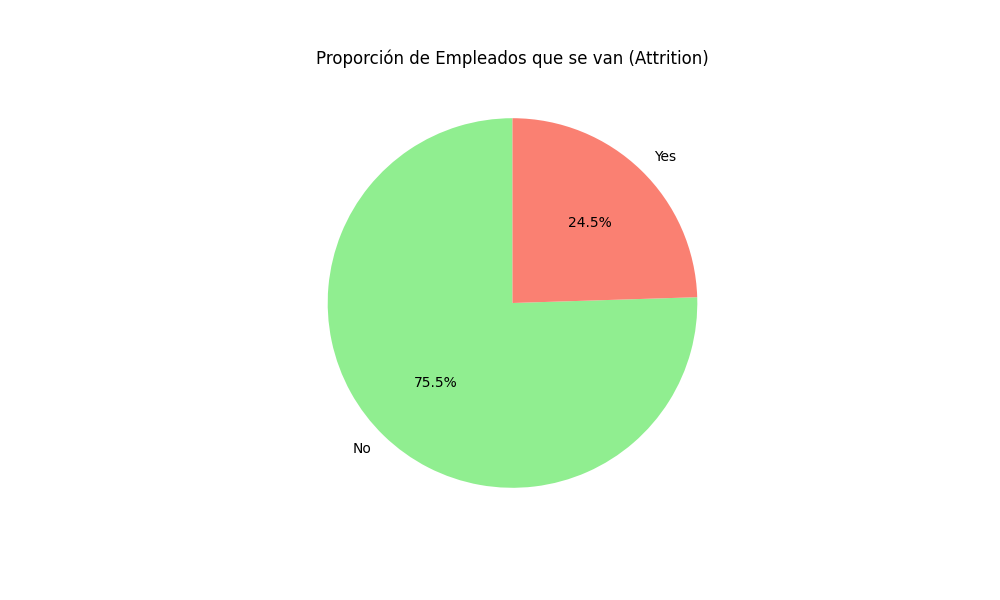

# 📊 HR Analytics Project


## 📝 Descripción

Este proyecto analiza un dataset de Recursos Humanos para responder preguntas clave sobre la demografía, salarios y rotación de empleados. El análisis se enfoca en identificar segmentos específicos de empleados y calcular métricas financieras relacionadas con la retención de talento.

**Dataset:** 1,000 registros de empleados.

## 📉 Métricas Clave

* **Tasa de Rotación (Attrition):** 24.5%
* **Costo Estimado de Rotación:** $3,460,268.80
* **Salario Promedio:** $71,250

## 🎯 Preguntas de Negocio Resueltas

El script de análisis (`hr_analysis.py`) resuelve las siguientes interrogantes:

1. **Jóvenes y Ricos:** Identificación de empleados menores de 30 años con salarios superiores a $80,000.
2. **Pérdida en Ventas:** Cálculo del salario promedio de los empleados del departamento de 'Sales' que han dejado la empresa.
3. **Diversidad en Marketing:** Análisis del rango de edad (mínima y máxima) en el equipo de Marketing.
4. **Clase Media:** Determinación de la edad promedio de los empleados con salarios entre $60,000 y $80,000.
5. **Fuerza Comercial:** Conteo total de empleados en los departamentos de 'Sales' y 'Marketing'.
6. **El Costo del Adiós:** Estimación del costo financiero total de la rotación de empleados (asumiendo un costo del 20% del salario anual).

## 📊 Visualización de Datos

El proyecto ahora incluye gráficos generados con **Matplotlib** para facilitar la interpretación de los datos:

* **Distribución de Empleados por Departamento:** Gráfico de barras para comparar el tamaño de los equipos.


> **Insight:** El departamento de **Sales** cuenta con la mayor cantidad de empleados, lo que indica que es el motor principal de la organización.

* **Distribución de Salarios:** Histograma para analizar los rangos salariales más comunes.


> **Insight:** La distribución salarial muestra un promedio de **$71,250**, con una concentración significativa en rangos medios.

* **Proporción de Attrition:** Gráfico de pastel para visualizar el porcentaje de rotación de personal.


> **Insight:** Se ha identificado una tasa de rotación del **24.5%**, una cifra considerable que sugiere la necesidad de revisar las políticas de retención.

## 🛠️ Tecnologías Utilizadas

* **Python 3.x**
* **Pandas:** Para manipulación, limpieza y análisis de datos.
* **Matplotlib:** Para la generación de gráficos y visualización de datos.

## 🚀 Cómo ejecutar este proyecto

1. Clonar el repositorio.
2. Crear y activar el entorno virtual (opcional pero recomendado):

    ```bash
    python -m venv venv
    .\venv\Scripts\Activate  # En Windows
    ```

3. Instalar dependencias:

    ```bash
    pip install pandas matplotlib
    ```

4. Ejecutar el script de análisis:

    ```bash
    python src/hr_analysis.py
    ```

## 📂 Estructura del Proyecto

```text
HR_Analytics_Project/
├── data/
│   └── hr_data.csv       # Dataset
├── img/                  # Gráficos generados
├── src/
│   ├── generate_hr_data.py  # Script para crear los datos (opcional)
│   └── hr_analysis.py       # Script principal de análisis
├── venv/                 # Entorno virtual
└── README.md             # Documentación del proyecto
```
